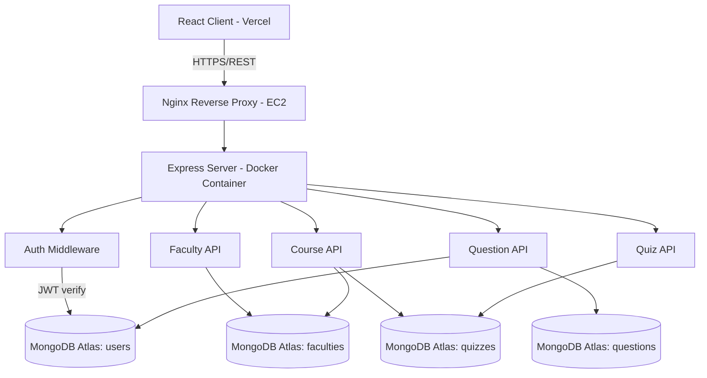

# RevQuiz — Full-Stack Quiz Platform

[](https://github.com/abdomohamed911/revquiz-platform/actions/workflows/ci.yml)

A full-stack quiz platform for Alamein International University. Students select their faculty, course, and difficulty level, then take quizzes with real-time scoring and persistent score tracking.

## Screenshots


## Live Demo

| Resource | URL |
|---|---|
| **Frontend (Vercel)** | [https://revquiz-platform.vercel.app](https://revquiz-platform.vercel.app) |
| **Backend (AWS EC2)** | Pending deployment |
| **Health Check** | Pending deployment (`/api/health`) |
| **Demo Login** | `demo@test.com` / `Demo123!` |
| **Admin Login** | `admin@test.com` / `Admin123!` |

## What It Does

RevQuiz lets students practice course material through structured quizzes. The workflow is: pick faculty, pick course, pick difficulty, take quiz, see results. An admin panel allows content managers to create faculties, courses, quizzes, and questions through a CRUD interface. All quiz data is stored in MongoDB Atlas and user scores persist across sessions. The platform supports three difficulty levels (easy, medium, hard), per-question and per-quiz solving with immediate feedback, and role-based access control separating student and admin views.

## Why I Built It

This started as a university web programming course project at Alamein International University. The goal was to move beyond todo-list tutorials and build something with real CRUD relationships (faculties contain courses, courses contain quizzes, quizzes contain questions with correct/incorrect options), user authentication, and role-based access control. It was my first exposure to building a full TypeScript backend with Mongoose, and I wanted to push beyond basic CRUD by implementing quiz-solving logic with score tracking, difficulty-based question filtering, and an admin panel for content management.

## Tech Stack

| Layer | Technology |
|---|---|
| Frontend | React 19, JavaScript, Tailwind CSS |
| Backend | Express 4, TypeScript (strict mode), Node.js 20 |
| Database | MongoDB Atlas (M0 Free Tier) with Mongoose ODM |
| Auth | JWT with bcryptjs password hashing |
| Rate Limiting | express-rate-limit (10 req/15min on auth) |
| Testing | Jest, Supertest, ts-jest (76 unit tests, 9 suites) |
| CI/CD | GitHub Actions (lint + typecheck + build + test) |
| Deployment | AWS EC2 + Docker (backend) + Vercel (frontend) |
| Containerization | Docker multi-stage build + docker-compose |

## Architecture



## API Endpoints

### Health

| Method | Endpoint | Auth | Description |
|---|---|---|---|
| GET | `/api/health` | No | Health check (returns `{ ok: true, timestamp }`) |

### Auth

| Method | Endpoint | Auth | Description |
|---|---|---|---|
| POST | `/auth/signup` | No | Register new user |
| POST | `/auth/login` | No | Login, returns JWT |
| GET | `/users/me` | Yes | Get current user profile |

### Faculties, Courses, Quizzes, Questions

All CRUD resources follow the same pattern: GET (list/get by ID) is public, POST/PUT/DELETE require admin role.

| Method | Endpoint | Auth | Description |
|---|---|---|---|
| GET/POST | `/faculties` | No / Admin | List / Create faculty |
| GET/PUT/DELETE | `/faculties/:id` | No / Admin | Get / Update / Delete |
| GET/POST | `/courses` | No / Admin | List (filter by `faculty`) / Create |
| GET/POST | `/quizzes` | No / Admin | List (filter by `course`) / Create |
| GET/POST | `/questions` | Yes / Admin | List (filter by `quiz`) / Create |
| POST | `/questions/:id/solve` | Yes | Submit answer for single question |
| POST | `/questions/quiz/:quizId/solve` | Yes | Submit all answers for a quiz |

## Quick Start

### Prerequisites

- Node.js 20+
- MongoDB 7+ (local or Atlas)

### Setup

```bash
git clone https://github.com/abdomohamed911/revquiz-platform.git
cd revquiz-platform

# 1. Create environment file
cp server/.env.example server/.env
# Edit .env with your MongoDB connection string and JWT secret

# 2. Install and start backend
cd server
npm install
npm run dev

# 3. Seed database (in a new terminal)
npm run seed

# 4. Install and start frontend (in a new terminal)
cd ../client
cp .env.example .env.local
# Set REACT_APP_API_URL=http://localhost:5000 in .env.local
npm install
npm start
```

The server runs on `http://localhost:5000` and the client on `http://localhost:3000`.

### Docker

```bash
# Start everything (MongoDB + server + client with nginx proxy)
docker compose up --build

# Seed the database
npm run docker:seed
```

Access the app at `http://localhost:3000`.

### Demo Credentials

After running the seeder, use these accounts:

| Role | Email | Password |
|---|---|---|
| Admin | admin@test.com | Admin123! |
| Demo User | demo@test.com | Demo123! |

## Deployment

### Backend (AWS EC2 + Docker)

The backend runs in a Docker container on an EC2 t2.micro (free tier) instance behind an nginx reverse proxy with TLS (Let's Encrypt).

1. Launch EC2 t2.micro (Ubuntu 22.04, free tier)
2. Install Docker and docker-compose
3. Clone the repo and configure environment variables
4. Run `docker compose up -d --build`
5. Configure nginx as reverse proxy with Let's Encrypt SSL

Environment variables for the server container:

| Variable | Description |
|---|---|
| `MONGODB_URI` | MongoDB Atlas connection string |
| `JWT_SECRET` | Random 32+ character string |
| `CORS_ORIGIN` | Vercel frontend URL (comma-separated for multiple) |
| `NODE_ENV` | `production` |
| `SEED_KEY` | Key required to trigger the `/seed` endpoint |

### Frontend (Vercel)

1. Import `abdomohamed911/revquiz-platform` on [Vercel](https://vercel.com)
2. Root directory: `/client`
3. Framework preset: Create React App (auto-detected)
4. Environment variables:
   - `REACT_APP_API_URL` — Your EC2 backend HTTPS URL

### Seeding Production

After the backend is deployed, seed the production database by sending a POST request to the `/seed` endpoint with the `X-Seed-Key` header:

```bash
curl -X POST https://your-ec2-domain.com/seed \
  -H "Content-Type: application/json" \
  -H "X-Seed-Key: your-seed-key"
```

This creates the admin user, demo user, 3 faculties, 6 courses, 8 quizzes, and 40 questions.

## Results

| Metric | Value |
|---|---|
| Backend test coverage | 76 unit tests (9 suites) |
| API response time | Sub-100ms on local |
| Data models | 5 (User, Faculty, Course, Quiz, Question) |
| API endpoints | 18 authenticated + public |
| Quiz flow | Faculty > Course > Difficulty > Quiz > Results |

## What I Learned

1. **Generic CRUD controllers save time but have limits**: The `baseController` pattern that auto-generates CRUD handlers from Mongoose schemas worked well for simple resources but needed custom handlers for the quiz-solving logic. Knowing when to break out of the abstraction is important.

2. **`select: false` in Mongoose hides fields everywhere**: I used `select: false` on `isCorrect` to prevent quiz answers from leaking in list queries, but this also means admin endpoints need to explicitly select the field when verifying correct answers. The tradeoff between security and convenience required careful thought.

3. **Test isolation matters with in-memory state**: Each test needs a fresh database state. Using MongoDB's `dropDatabase` in `afterAll` and creating test-specific data in `beforeAll` prevents test order dependencies. Setting up proper test fixtures upfront saved hours of debugging flaky tests.

## License

MIT
