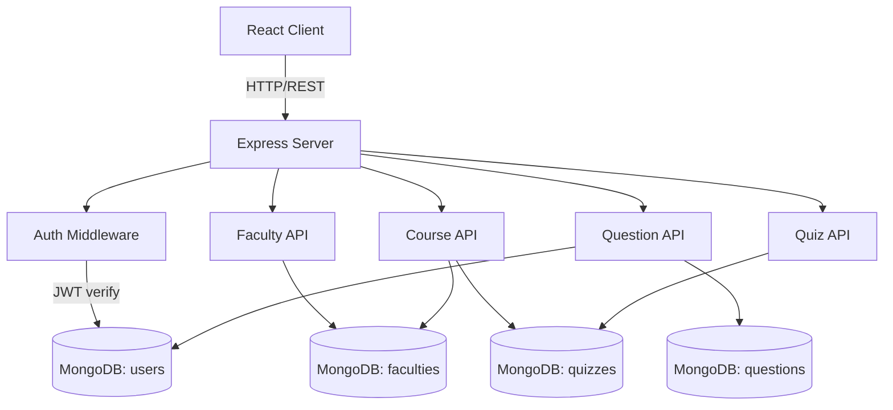

# RevQuiz -- Full-Stack Quiz Platform

A full-stack quiz platform for Alamein International University. Students select their faculty, course, and difficulty level, then take quizzes with real-time scoring and persistent score tracking.

## What It Does

RevQuiz lets students practice course material through structured quizzes. The workflow is: pick faculty, pick course, pick difficulty, take quiz, see results. An admin panel allows content managers to create faculties, courses, quizzes, and questions through a CRUD interface. All quiz data is stored in MongoDB and user scores persist across sessions.

## Why I Built It

This started as a university web programming course project at Alamein International University. The goal was to move beyond todo-list tutorials and build something with real CRUD relationships (faculties contain courses, courses contain quizzes, quizzes contain questions with correct/incorrect options), user authentication, and role-based access control. It was my first exposure to building a full TypeScript backend with Mongoose.

## Tech Stack

| Layer | Technology |
|---|---|
| Frontend | React 19, JavaScript, Tailwind CSS |
| Backend | Express 4, TypeScript (strict mode), Node.js 20 |
| Database | MongoDB with Mongoose ODM |
| Auth | JWT with bcryptjs password hashing |
| Rate Limiting | express-rate-limit (10 req/15min on auth) |
| Testing | Jest, Supertest, ts-jest |
| CI/CD | GitHub Actions (lint + typecheck + test) |
| Containerization | Docker + docker-compose (MongoDB + server + nginx) |

## Architecture



## API Endpoints

### Auth

| Method | Endpoint | Auth | Description |
|---|---|---|---|
| POST | `/auth/signup` | No | Register new user |
| POST | `/auth/login` | No | Login, returns JWT |
| GET | `/users/me` | Yes | Get current user profile |

### Faculties, Courses, Quizzes, Questions

All CRUD resources follow the same pattern: GET (list/get by ID) is public, POST/PUT/DELETE require admin role.

| Method | Endpoint | Auth | Description |
|---|---|---|---|
| GET/POST | `/faculties` | No / Admin | List / Create faculty |
| GET/PUT/DELETE | `/faculties/:id` | No / Admin | Get / Update / Delete |
| GET/POST | `/courses` | No / Admin | List (filter by `faculty`) / Create |
| GET/POST | `/quizzes` | No / Admin | List (filter by `course`) / Create |
| GET/POST | `/questions` | Yes / Admin | List (filter by `quiz`) / Create |
| POST | `/questions/:id/solve` | Yes | Submit answer for single question |
| POST | `/questions/quiz/:quizId/solve` | Yes | Submit all answers for a quiz |

## Quick Start

### Prerequisites

- Node.js 20+
- MongoDB 7+ (local or Atlas)
- pnpm (for server), npm (for client)

### Setup

```bash
git clone https://github.com/abdomohamed911/revquiz-platform.git
cd revquiz-platform

# 1. Create environment file
cp .env.example .env
# Edit .env with your MongoDB connection string and JWT secret

# 2. Install and start backend
cd server
pnpm install
pnpm dev

# 3. Seed database (in a new terminal)
pnpm seed

# 4. Install and start frontend (in a new terminal)
cd ../client
npm install
npm start
```

The server runs on `http://localhost:5000` and the client on `http://localhost:3000`.

### Docker

```bash
# Start everything (MongoDB + server + client with nginx proxy)
docker compose up --build

# Seed the database
docker compose exec server pnpm ts-node -r tsconfig-paths/register scripts/seeder.ts
```

Access the app at `http://localhost:3000`.

### Demo Credentials

After running the seeder, use these accounts:

| Role | Email | Password |
|---|---|---|
| Admin | admin@test.com (first seeded user) | password123 |
| User | user1@test.com | password123 |

## Results

| Metric | Value |
|---|---|
| Backend test coverage | Target 70%+ (Jest + Supertest) |
| API response time | Sub-100ms on local |
| Data models | 5 (User, Faculty, Course, Quiz, Question) |
| API endpoints | 18 authenticated + public |
| Quiz flow | Faculty > Course > Difficulty > Quiz > Results |

## What I Learned

1. **Generic CRUD controllers save time but have limits**: The `baseController` pattern that auto-generates CRUD handlers from Mongoose schemas worked well for simple resources but needed custom handlers for the quiz-solving logic. Knowing when to break out of the abstraction is important.

2. **`select: false` in Mongoose hides fields everywhere**: I used `select: false` on `isCorrect` to prevent quiz answers from leaking in list queries, but this also means admin endpoints need to explicitly select the field when verifying correct answers. The tradeoff between security and convenience required careful thought.

3. **Test isolation matters with in-memory state**: Each test needs a fresh database state. Using MongoDB's `dropDatabase` in `afterAll` and creating test-specific data in `beforeAll` prevents test order dependencies. Setting up proper test fixtures upfront saved hours of debugging flaky tests.

## License

MIT
